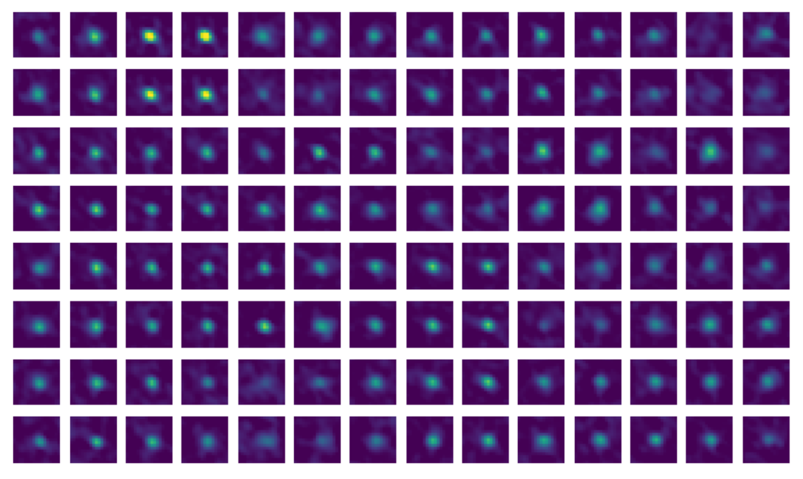

# Registration

Suite2p performs motion correction by registering each frame to a reference image using phase-correlation. The settings for registration are in the `registration` dictionary. Frames are processed in batches of `batch_size` frames, which may need to be reduced on GPUs with less memory.

You can register using either the functional or anatomical channel. If your second channel (e.g. td-Tomato) has higher SNR, set `settings['registration']['align_by_chan2']` to True to compute shifts from that channel which will be applied to both channels. During registration, all frames are cumulatively averaged to produce a mean image, saved as `meanImg` (and `meanImg_chan2` if a second channel is present).

## Bidirectional phase offset (optional)

If `settings['registration']['do_bidiphase']` is True, the bidirectional phase offset is estimated from a subset of frames of length `settings['registration']['nimg_init']`. The offset is the optimal shift between odd and even scan lines, computed via phase-correlation. Alternatively, a known offset can be specified directly with `settings['registration']['bidiphase']`. The offset is applied to all frames before computing motion shifts and when applying the shifts. The computed value is saved in `reg_outputs.npy` as `bidiphase`.

## Reference image computation

A subset of frames of length `settings['registration']['nimg_init']` is sampled at equal spacing from the movie. The pairwise correlations between these frames are computed. The frame with the largest correlation to its 20 most-correlated frames is selected, and these 20 frames are averaged as an initial reference image.

This reference is then refined iteratively across 8 iterations of rigid phase-correlation alignment. On each iteration, the frames most correlated to the current reference are averaged (after applying estimated shifts) to create a new reference. The number of frames averaged increases with each iteration as `nimg_init * (1 + i) / 16`. The final reference image is saved as `refImg`.

If the reference image looks blurry, try increasing `nimg_init`.

## Rigid registration

Rigid registration computes a single (dy, dx) offset between each frame and the reference image using phase-correlation.

### How it works

1. **Intensity clipping**: If `settings['registration']['norm_frames']` is True, both the reference image and each frame are clipped to the 1st and 99th percentile intensity values of the reference (saved as `rmin` and `rmax`).

2. **Whitening and smoothing**: The reference image is transferred to the Fourier domain, whitened, and smoothed by a Gaussian with standard deviation `settings['registration']['smooth_sigma']`.

3. **Spatial tapering**: A sigmoid mask is applied to each frame so that the phase-correlation is focused on the center of the field of view rather than the edges. The slope of the sigmoid is controlled by `settings['registration']['spatial_taper']`.

4. **Phase-correlation**: Each whitened frame is cross-correlated with the whitened reference. The peak of the phase-correlation is found within a range defined by `settings['registration']['maxregshift']` (as a fraction of the frame size). The peak location gives the (dy, dx) offset.

5. **Shift application**: Frames are shifted using the `roll` operation -- this fills edges with opposing edges, but these regions are excluded during ROI detection.

The shifts are saved as `yoff` and `xoff`, and the peak phase-correlation values as `corrXY`.

Cross-correlation

Phase-correlation

Comparison

(see bioRxiv preprint comparing cross/phase [here](https://www.biorxiv.org/content/early/2016/06/30/061507))

## Non-rigid registration

We strongly recommend running non-rigid registration (`settings['registration']['nonrigid']=True`), as it does not add substantially to the runtime. After rigid registration, non-rigid registration computes per-block shifts to correct local deformations.

### How it works

1. **Block decomposition**: The frame is divided into overlapping square sub-blocks (overlapping by at least 50% in each dimension), with size defined by `block_size`.

2. **Per-block phase-correlation**: Each block is spatially tapered, whitened, and phase-correlated with the corresponding reference block. The maximum allowed shift per block is `settings['registration']['maxregshiftNR']` pixels.

Phase correlation of each block:

Shift of each block from phase corr:

3. **SNR-adaptive smoothing**: Some blocks on some frames may have low SNR. The SNR is estimated as the ratio between the peak phase-correlation and the maximum outside the peak region (3x3 pixels). If the SNR is below `settings['registration']['snr_thresh']`, the phase-correlation map is replaced with a smoothed version (Gaussian with standard deviation of one block). If still below threshold after one smoothing, a twice-smoothed version is used.

4. **Subpixel estimation**: The phase-correlation map is upsampled by a factor of 10 around the peak using Kriging interpolation (Gaussian kernel, sigma = 0.85 pixels) to obtain subpixel shift estimates.

5. **Bilinear interpolation**: Block-wise shifts are interpolated to per-pixel shifts assuming each block shift corresponds to its center pixel. The frame is then warped using bilinear interpolation via `torch.nn.functional.grid_sample`.

## Valid region estimation

Because frames shift during registration, edges of the FOV may lack information. These edge regions are excluded from ROI detection.

Bad frames are identified by two criteria:
- **Motion outliers**: The rigid shifts are median-filtered in time (window of 101 frames). Frames with large deviations from the median, relative to low correlation, are marked bad if the ratio exceeds `100 * th_badframes`.
- **Extreme shifts**: Frames where the shift exceeds 95% of the maximum allowed rigid shift (`maxregshift`).

After excluding bad frames, the maximum absolute shifts in Y and X define the excluded edge widths. The valid region is saved as `yrange` and `xrange`.

## Two-step registration (optional)

If `settings['registration']['two_step_registration']` is True and a raw (unregistered) file is available, registration is performed twice: once to build a reference, then again with a refined reference computed from the non-bad frames from the first pass of registration only.

## Registration metrics

Registration quality is assessed using PCA on a subset of 2,000-5,000 registered frames (2,000 if the frame size exceeds 700 pixels to avoid memory issues). The frames are cropped to the valid region and the top 30 principal components are computed. For each PC, the 300 frames with the smallest and 300 with the largest weights are averaged separately. These top and bottom mean frames are registered to each other. The resulting shifts quantify residual motion:

- **Rigid shift distance**: magnitude of the rigid shift between top/bottom PC averages
- **Mean non-rigid shift**: non-rigid shift distance averaged across blocks
- **Max non-rigid shift**: maximum non-rigid shift across blocks
- **Combined shift**: rigid plus non-rigid shift, averaged across blocks

These are saved as `regDX` in `reg_outputs`, along with the PC time courses (`tPC`) and spatial components (`regPC`). The movie must have at least 1500 frames for metrics to be computed.

## Key parameters (`registration`)

| Parameter | Description |
|---|---|
| `batch_size` | Number of frames processed per batch, if the GPU has a lower memory capacity this may need to be reduced (default: 500) |
| `nimg_init` | Number of frames sampled for reference image initialization and bidiphase estimation, this may need to be increased if the resulting `refImg` is blurry (default: 300) |
| `nonrigid` | Enable non-rigid registration after rigid registration (default: True) |
| `maxregshift` | Maximum rigid shift as a fraction of the frame size (default: 0.1) |
| `smooth_sigma_time` | Standard deviation of Gaussian for temporal smoothing of phase-correlation maps; 0 to disable, only use if data is very low SNR (default: 0) |
| `spatial_taper` | Slope of the sigmoid spatial taper at frame borders, increase this if there is vignetting on the edge of the image, like in one-photon imaging (default: 3.45) |
| `block_size` | Block size [Y, X] in pixels for non-rigid registration (default: [128, 128]) |
| `maxregshiftNR` | Maximum non-rigid shift per block in pixels (default: 5) |
| `snr_thresh` | SNR threshold below which non-rigid phase-correlation maps are smoothed across blocks, increase to enforce more smoothing if the output is jumping around in areas with low signal (default: 1.2) |
| `th_badframes` | Threshold multiplier for detecting bad frames from motion/correlation outliers, decrease to remove more frames if the cropped area in detection seems too large (default: 1.0) |
| `two_step_registration` | Re-register with a refined reference after excluding bad frames (default: False) |
| `align_by_chan2` | Use the second (anatomical) channel to compute registration shifts (default: False) |